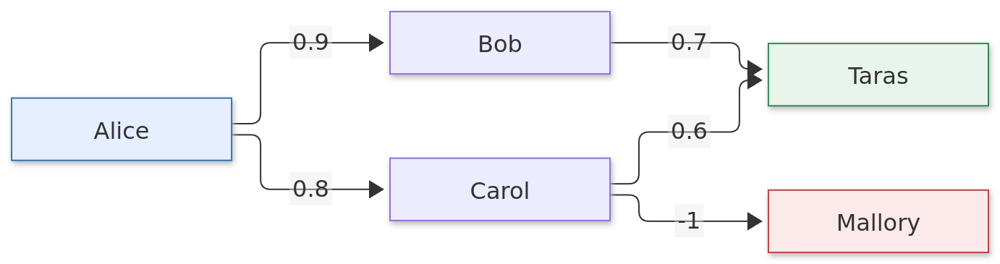

# Inlay

**The source stays with the picture.**

Inlay opens a PNG alongside the diagram source embedded inside it. Edit the source,
preview the result, and save both back into the same image. The PNG remains an ordinary
picture that you can insert into documents or send to someone else.



| Component | Location | Status |
| --- | --- | --- |
| Desktop editor | `app/` | Working prototype: Python, executable scripts, live Mermaid |
| AI skill | `skills/inlay/` | Portable instructions and source metadata helper |
| LibreOffice Writer extension | `integrations/libreoffice/` | Native embedded diagrams, source storage and editor integration |

## Install on Linux

From a checkout or extracted source ZIP:

```sh
./install.sh
inlay
```

Installs for your user without sudo. See [Linux installation](docs/install-linux.md)
for prerequisites, custom paths, updates and removal.

## Run from the checkout

Python 3.11 or newer is required. Linux is the currently verified platform.

```sh
python3 -m venv .venv
.venv/bin/python -m pip install -e ./app
bin/inlay examples/trust.png
```

Run `bin/inlay` without arguments for a new Python diagram. Choose **New → Mermaid**
for a live Mermaid diagram. The positional CLI argument opens an existing PNG;
use **Import source** in the editor for a plain source file.

Mermaid renders locally through QtWebEngine with a bundled renderer. No account,
CDN, Node installation or service is required at runtime. Executable diagram sources
run as local programs with your user's permissions.

## Use with an AI agent

Copy `skills/inlay/` into your agent's skill directory (for Codex,
`~/.codex/skills/inlay/`). Its metadata helper uses only Python's standard library;
it does not require the desktop editor. Build a portable archive with:

```sh
python3 tools/build_skill.py
```

The archive is written to `dist/inlay-skill.zip`.

## LibreOffice Writer

Install the editor, close LibreOffice normally, then run
`./integrations/libreoffice/install.sh`. The new **Inlay** menu inserts and edits
native diagram objects. Source and preview travel inside the ODT; recipients can
view and print without the extension. [Installation and usage](integrations/libreoffice/README.md).

## Documentation

- [Usage](docs/usage.md)
- [PNG source format](docs/format.md)
- [Development and tests](docs/development.md)
- [Roadmap](docs/roadmap.md)
- [LibreOffice extension](integrations/libreoffice/README.md)

Created by **sergeych** and **Codex (OpenAI)**. See [authors](AUTHORS.md).

Our code is licensed under [MIT](LICENSE). Bundled third-party code retains its
own licenses; see [third-party notices](THIRD_PARTY_NOTICES.md).
